# 🚀 MindFlare: Explore the Cosmos of Knowledge ✨

Embark on an immersive journey with **MindFlare**—where education transcends earthly limits and soars through the cosmos.

```mermaid
flowchart TD
  subgraph MindFlare
    style MFText fill:#000033,stroke:#ffffff,stroke-width:3px;
    MFText ---o|🌌 Explore Topics| MFText[" "]
    MFText ===>|🚀 Navigate Learning Paths| MFText[" "]
    MFText -.->|🛰️ Interact with your educational experience| MFText(("LIMITLESS
    POSSIBILITIES
     "))
  end
```

In the cosmic expanse of MindFlare, users launch into an educational odyssey, exploring topics, navigating personalized learning paths, and engaging in an interactive educational experience. The knowledge space expands into a cosmic realm, revealing wonders to discover.

Journey through MindFlare, where learning becomes an interstellar adventure, and knowledge awaits exploration in the cosmic space of endless possibilities.🌌📚

Documentation Used => https://mermaid.js.org/

Special Thanks => https://github.com/ajaymarathe/bootstrap-login-template
